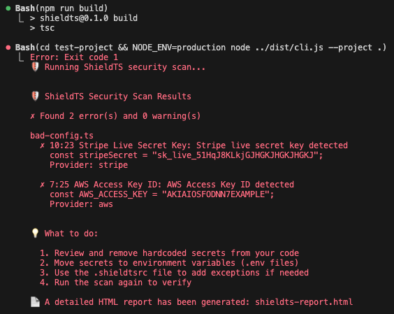
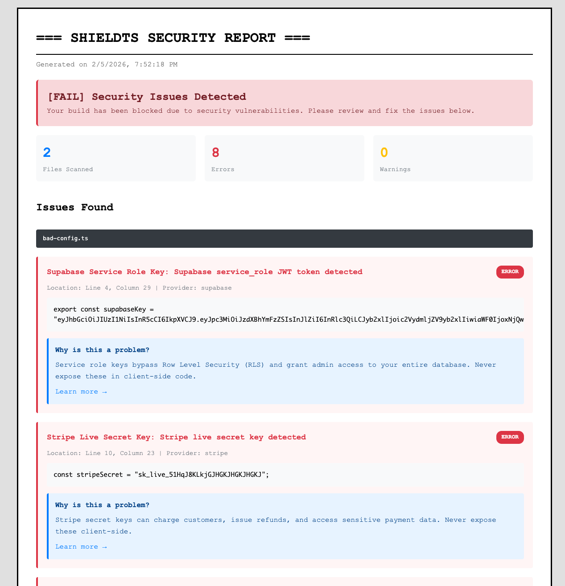

# ShieldTS

**TypeScript Security Scanner** - Prevent builds with exposed secrets and vulnerabilities.

ShieldTS is a static analysis security tool that scans your TypeScript/JavaScript codebase for hardcoded secrets, API keys, and security vulnerabilities. It integrates seamlessly into your build process and blocks deployments when security issues are detected.

## Preview

### Console Output


### HTML Report


## Features

- ✅ **Static Analysis** - AST-based scanning using TypeScript Compiler API
- ✅ **Pattern Detection** - Detects secrets from Supabase, Firebase, AWS, Stripe, and more
- ✅ **Entropy Analysis** - Identifies high-entropy strings that may be secrets
- ✅ **Context-Aware** - Distinguishes between client-side and server-side code
- ✅ **Build Blocking** - Prevents production builds with security issues
- ✅ **Detailed Reporting** - Console output + HTML report with educational content
- ✅ **Configurable** - Use `.shieldtsrc` to customize rules and exceptions

## Installation

```bash
npm install --save-dev shieldts
```

## Quick Start

### 1. Add to your build process

```json
{
  "scripts": {
    "build": "shieldts && next build"
  }
}
```

ShieldTS will automatically run before your build and block if security issues are found.

### 2. Run manually

```bash
npx shieldts
```

### 3. Environment Behavior

ShieldTS runs when:
- `NODE_ENV=production` (recommended for production builds)
- `NODE_ENV` is undefined (catches local builds without env set)

Skip in development:
```bash
NODE_ENV=development npm run build  # ShieldTS skips
```

Force run regardless of environment:
```bash
npx shieldts --no-check-env
```

## Configuration

Create a `.shieldtsrc` file in your project root:

```json
{
  "ignore": {
    "files": ["**/*.test.ts", "**/mocks/**"],
    "patterns": ["example_key", "test_token"],
    "lines": ["src/config.ts:42"]
  },
  "severity": {
    "highEntropy": "error",
    "knownPatterns": "error",
    "base64Secrets": "warning"
  },
  "thresholds": {
    "entropyScore": 4.5,
    "minSecretLength": 20
  }
}
```

See `.shieldtsrc.example` for all options.

## What Does It Detect?

### 1. Known Secret Patterns
- Supabase service role keys
- Stripe secret keys (live and test)
- AWS access keys
- Firebase API keys and service accounts
- Generic API keys, tokens, passwords
- Bearer tokens
- Private keys (RSA, EC)

### 2. High-Entropy Strings
Detects random-looking strings that are likely secrets but don't match known patterns.

### 3. Client-Side Secrets
Identifies server-only environment variables used in client-side code (e.g., `process.env.SECRET_KEY` in a React component).

### 4. Base64-Encoded Secrets
Decodes Base64 strings and checks for secret-related keywords.

## Output

ShieldTS provides two types of reports:

### Console Output
Terminal-based report showing all security issues found, with file locations and severity levels. See screenshots in the Preview section above.

### HTML Report
A detailed `shieldts-report.html` file is generated in your project root with:
- Summary statistics
- Issue details with code snippets
- Educational content explaining why each issue is dangerous
- Links to security best practices

See screenshots in the Preview section above.

## Best Practices

1. **Use Environment Variables**
   ```typescript
   // ❌ Bad
   const key = "sk_live_abc123...";

   // ✅ Good
   const key = process.env.STRIPE_SECRET_KEY;
   ```

2. **Client vs Server Code**
   ```typescript
   // ❌ Bad (client-side)
   const db = process.env.DATABASE_URL; // Exposed to browser!

   // ✅ Good (server-side only)
   const db = process.env.DATABASE_URL; // OK in API routes
   ```

3. **Public vs Private Keys**
   ```typescript
   // ✅ OK for client-side (Next.js)
   const publicKey = process.env.NEXT_PUBLIC_STRIPE_KEY;

   // ❌ Never in client-side
   const secretKey = process.env.STRIPE_SECRET_KEY;
   ```

## CLI Options

```bash
shieldts [options]

Options:
  -p, --project <path>   Project root directory (default: current directory)
  --no-check-env         Run regardless of NODE_ENV
  -V, --version          Output version number
  -h, --help             Display help
```

## Integration Examples

### Next.js
```json
{
  "scripts": {
    "build": "shieldts && next build",
    "dev": "next dev"
  }
}
```

### React (CRA)
```json
{
  "scripts": {
    "build": "shieldts && react-scripts build"
  }
}
```

### Vite
```json
{
  "scripts": {
    "build": "shieldts && vite build"
  }
}
```

### CI/CD (GitHub Actions)
```yaml
- name: Security Scan
  run: npm run build  # ShieldTS runs automatically
```

## Why ShieldTS?

Modern web development makes it easy to accidentally expose secrets:
- ❌ Hardcoded API keys in source code
- ❌ Service role keys in client bundles
- ❌ Database URLs committed to Git
- ❌ Admin credentials in environment variables without proper access control

ShieldTS acts as a **security safety net** that:
- ✅ Catches secrets before they reach production
- ✅ Educates developers on security best practices
- ✅ Prevents data breaches from exposed credentials
- ✅ Integrates seamlessly into existing workflows

## License

MIT

## Contributing

Contributions welcome! Please open an issue or PR.

## Learn More

- [OWASP Top 10](https://owasp.org/www-project-top-ten/)
- [Next.js Environment Variables](https://nextjs.org/docs/app/building-your-application/configuring/environment-variables)
- [Stripe API Keys](https://stripe.com/docs/keys)
- [Supabase API Keys](https://supabase.com/docs/guides/api/api-keys)
